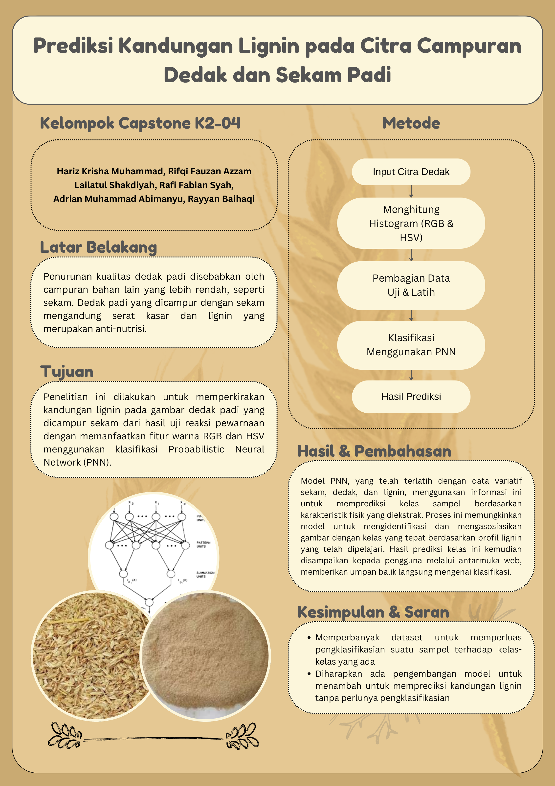

# Dedak Classifier



## Overview
The Dedak Classifier is a machine learning application developed using Flask. It is designed to predict the lignin content in mixed images of rice bran and husk. The application employs a Probabilistic Neural Network (PNN) for analyzing image data and classifying it based on RGB and HSV histograms.

## Features
- **Image Input**: Allows users to upload images of dedak for analysis.
- **Histogram Calculation**: Computes RGB and HSV histograms to extract color features from the images.
- **Probabilistic Neural Network (PNN)**: Uses PNN for effective pattern recognition and classification based on probabilistic theories.
- **Data Splitting**: Splits the dataset into training and testing sets for model evaluation.
- **Lignin Content Prediction**: Predicts the lignin content, providing valuable insights into the sample composition.

## Installation

To get started with the Dedak Classifier, follow these steps:

1. **Clone the Repository**
   ```bash
   git clone https://github.com/rifqifazzam/Capstone-K2-04.git
   cd Capstone-K2-04
   ```


2. **Install Dependencies**
    ```bash
    pip install -r requirements.txt
    ```
3. **Run the Application**
    ```bash
    cd sekam-detection
    python app.py
    ```

## Usage
After launching the application, navigate to http://127.0.0.1:5000/ on your web browser to access the Dedak Classifier. Follow the on-screen instructions to upload an image and receive predictions on lignin content.

## Group Members

| NIM          | Nama                        |
|--------------|-----------------------------|
| G6401211106  | Hariz Krisha Muhammad       |
| G6401211008  | Rifqi Fauzan Azzam          |
| G6401211004  | Adrian Muhammad Abimanyu    |
| G6401211050  | Lailatul Shakdiyah          |
| G6401211087  | Rayyan Baihaqi              |
| G6401211025  | Rafi Fabian Syah            |